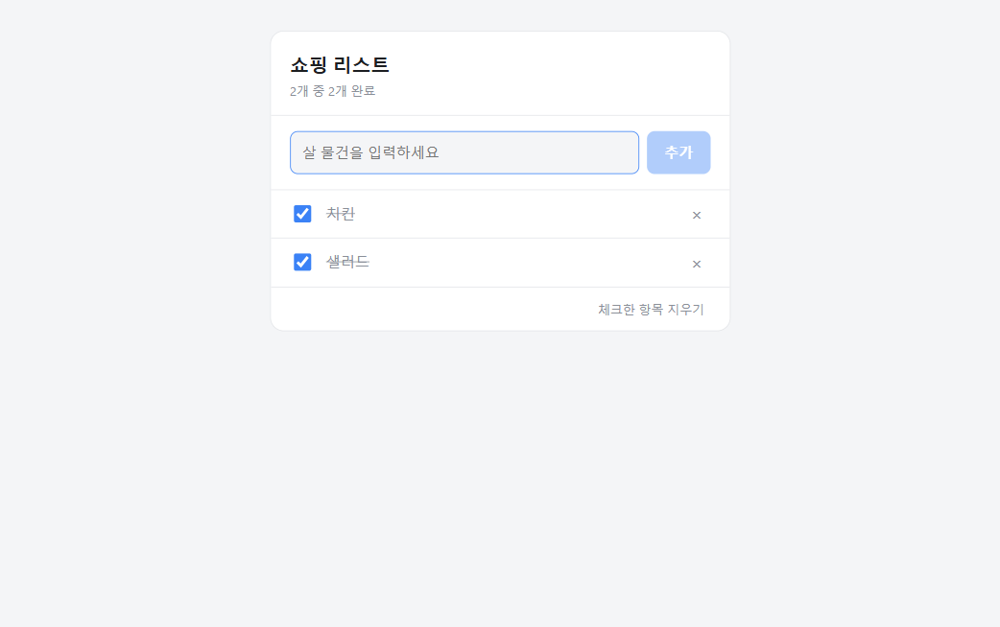

# 쇼핑 리스트

바닐라 HTML/CSS/JS로 만든 단일 파일 쇼핑 리스트 웹앱. 외부 라이브러리와 빌드 과정이 없습니다.

**[▶ 바로 실행해 보기](https://chaewon-park-study.github.io/shopping-list/)**



## 기능

- **추가** — 입력창에 물건 이름을 쓰고 Enter 또는 "추가" 버튼 (빈 입력은 거부)
- **체크** — 체크박스로 완료 표시, 취소선 처리와 함께 "N개 중 M개 완료" 카운터 갱신
- **삭제** — 항목별 `×` 버튼, 그리고 체크된 항목만 골라 지우는 일괄 삭제
- **저장** — `localStorage`에 자동 저장되어 브라우저를 닫아도 목록이 유지됨
- **다중 탭 동기화** — 같은 사이트를 여러 탭에 띄워도 `storage` 이벤트로 서로 반영
- **다크 모드** — `prefers-color-scheme`로 시스템 설정을 따름

## 실행 방법

`index.html` 파일을 브라우저로 열면 끝입니다. 서버가 필요 없습니다.

로컬 서버로 띄우고 싶다면:

```bash
python -m http.server 8137
# http://127.0.0.1:8137/
```

> `file://`로 열면 `crypto.randomUUID()`를 쓸 수 없어 대체 ID 생성 방식으로 넘어갑니다.
> 동작에는 차이가 없습니다.

## 구현 메모

- **XSS 안전** — 항목 이름을 `textContent`로 넣어 HTML이 실행되지 않습니다
- **ID 기반 삭제** — 배열 인덱스가 아닌 UUID로 항목을 지워 중간 항목 삭제 시에도 안전합니다
- **손상 데이터 내성** — `localStorage` 값이 깨져 있어도 크래시 없이 빈 목록으로 복구합니다
- **저장 실패 처리** — 용량 초과(출처당 5 MiB)나 저장 차단 시 사용자에게 알립니다

## 테스트

Playwright로 8개 시나리오(추가·체크·해제·삭제·일괄 삭제·새로고침 유지·손상 복구·XSS)를 검증했습니다.
자동 재실행 가능한 스펙 파일은 아직 없습니다.

## 라이선스

MIT
